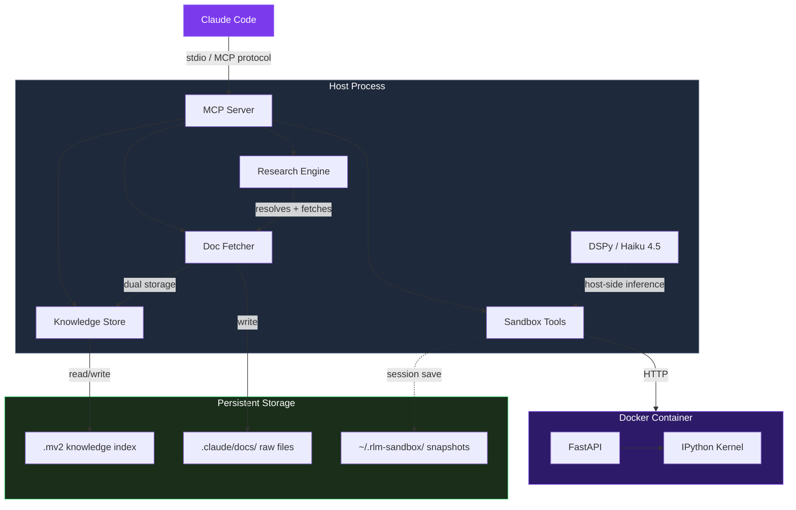
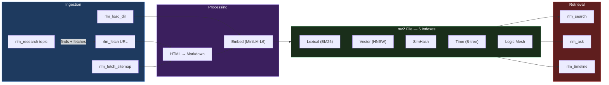

# rlm-sandbox

[](LICENSE)
[]()
[]()

Sandboxed Python execution + zero-context doc search for Claude Code. Run code in Docker without leaking API keys, search indexed documentation without reading files into the context window.

```
> Use rlm_search("async lifespan pattern") to find how FastAPI handles startup

Found 3 results:
  1. [0.89] fastapi/advanced/events.md — "Use the lifespan parameter..."
  2. [0.82] fastapi/tutorial/dependencies.md — "Dependencies with yield..."
  3. [0.71] fastapi/deployment/concepts.md — "Startup and shutdown events..."
```

## Table of Contents

- [Features](#features)
- [Architecture](#architecture)
- [Install](#install)
- [Quick Start](#quick-start)
- [Tools](#tools-16-total)
- [Knowledge Store](#knowledge-store)
- [Sandbox](#sandbox)
- [Configuration](#configuration)
- [Contributing](#contributing)
- [License](#license)

## Features

- **Sandboxed execution** — IPython kernel in Docker (no network, no API keys, 2GB memory cap)
- **DSPy sub-agents** — run recursive language model programs via Haiku 4.5, host-side
- **Hybrid doc search** — BM25 + vector search over `.mv2` files, ~5ms query latency
- **Doc fetching** — grab URLs, sitemaps, or local files into dual storage (raw markdown + search index)
- **One-call research** — `rlm_research("fastapi")` finds docs, fetches, indexes, done
- **Session persistence** — sandbox state survives MCP server restarts via dill snapshots
- **Plugin distribution** — installs as a Claude Code plugin with agents, skills, and hooks included

## Architecture



## Install

```
/plugin marketplace add shihwesley/shihwesley-plugins
/plugin install rlm-sandbox@shihwesley-plugins
```

First run auto-creates a Python venv and installs all dependencies.

Docker is optional — knowledge tools work without it, sandbox tools need it.

<details>
<summary>Manual setup (without plugin install)</summary>

```bash
git clone https://github.com/shihwesley/rlm-sandbox.git
cd rlm-sandbox
./scripts/setup.sh

# Start MCP server directly (stdio transport)
./scripts/start-server.sh

# Optional: build Docker sandbox image
docker compose up -d --build
```

</details>

## Quick Start

After installing, restart Claude Code. The `rlm-sandbox` MCP server appears with 16 tools.

**Index some docs and search them:**

```
> /rlm-sandbox:research fastapi

Indexed 47 pages for 'fastapi'. Use rlm_search to query.

> Use rlm_search("dependency injection") to find the pattern

Found 5 results:
  1. [0.94] tutorial/dependencies.md — "Declare the dependency..."
  2. [0.88] advanced/dependencies.md — "Sub-dependencies are resolved..."
```

**Run code in the sandbox:**

```
> Use rlm_exec to calculate the first 10 primes

Output:
[2, 3, 5, 7, 11, 13, 17, 19, 23, 29]
```

**Run a DSPy sub-agent:**

```
> Use rlm_sub_agent with signature "question -> answer" and input "What is the capital of France?"

Result: {"answer": "Paris"}
```

## Tools (16 total)

### Sandbox (requires Docker)

| Tool | What it does |
|------|-------------|
| `rlm_exec(code)` | Execute Python, return stdout/stderr |
| `rlm_load(path, var_name)` | Load a host file into a sandbox variable |
| `rlm_get(name)` | Get a variable or evaluate an expression |
| `rlm_vars()` | List all sandbox variables |
| `rlm_sub_agent(signature, inputs)` | Run a DSPy sub-agent (Haiku 4.5) |
| `rlm_reset()` | Clear all sandbox state |

### Knowledge Store (no Docker needed)

| Tool | What it does |
|------|-------------|
| `rlm_search(query, top_k, mode)` | Hybrid search (BM25 + vector) over indexed docs |
| `rlm_ask(question, context_only)` | RAG Q&A or context-only chunk retrieval |
| `rlm_timeline(since, until)` | Browse docs by recency |
| `rlm_ingest(title, text)` | Manually add content to the index |

### Fetching (no Docker needed)

| Tool | What it does |
|------|-------------|
| `rlm_fetch(url)` | Fetch URL → raw .md file + .mv2 index |
| `rlm_load_dir(glob)` | Bulk-load local files into both stores |
| `rlm_fetch_sitemap(url)` | Fetch all pages from a sitemap |

### Research & Management (no Docker needed)

| Tool | What it does |
|------|-------------|
| `rlm_research(topic)` | Find docs, fetch, index, confirm |
| `rlm_knowledge_status()` | Show indexed sources and sizes |
| `rlm_knowledge_clear()` | Wipe the .mv2 index |

## Knowledge Store



Each project gets one `.mv2` file at `~/.rlm-sandbox/knowledge/{project-hash}.mv2`. Five concurrent indexes in a single portable file — no sidecars, no lock files.

Embeddings use all-MiniLM-L6-v2 (384d, ~50MB model). No API keys, no external services. Falls back to lexical-only if sentence-transformers isn't installed.

The point: agents call `rlm_search` instead of reading entire doc files into context. A search returns ranked chunks in ~5ms. A full file read costs hundreds of tokens and fills the context window.

## Sandbox

Three isolation tiers:

| Tier | Method | Startup | When to use |
|------|--------|---------|-------------|
| 1 | Local subprocess | ~200ms | Quick iteration, trusted code |
| 2 | Docker container | ~4s | Default. No network, 2GB cap |
| 3 | Docker Sandboxes | TBD | Future — stronger isolation |

The container gets null DNS (no outbound network), no API keys, and no host filesystem access beyond `./workspace`. DSPy runs host-side so the container stays lean.

## Configuration

The plugin includes two custom agents and two skills:

| Component | Name | Purpose |
|-----------|------|---------|
| Agent | `rlm-researcher` | Delegates research tasks (fetch + index docs) |
| Agent | `rlm-sandbox` | Delegates code execution tasks |
| Skill | `/rlm-sandbox:research <topic>` | Manual research trigger |
| Skill | `/rlm-sandbox:knowledge-status` | Check what's indexed |

A PostToolUse hook on `mcp__context7__query-docs` nudges Claude to also index Context7 results into the knowledge store.

## Contributing

Bug reports and PRs welcome.

```bash
# Run the full test suite (209 tests)
pytest tests/ -v

# Knowledge/fetcher/research only (no Docker)
pytest tests/test_knowledge.py tests/test_fetcher.py tests/test_research.py

# Integration tests (requires Docker)
pytest tests/test_sandbox.py tests/test_mcp_server.py
```

## License

[MIT](LICENSE)
