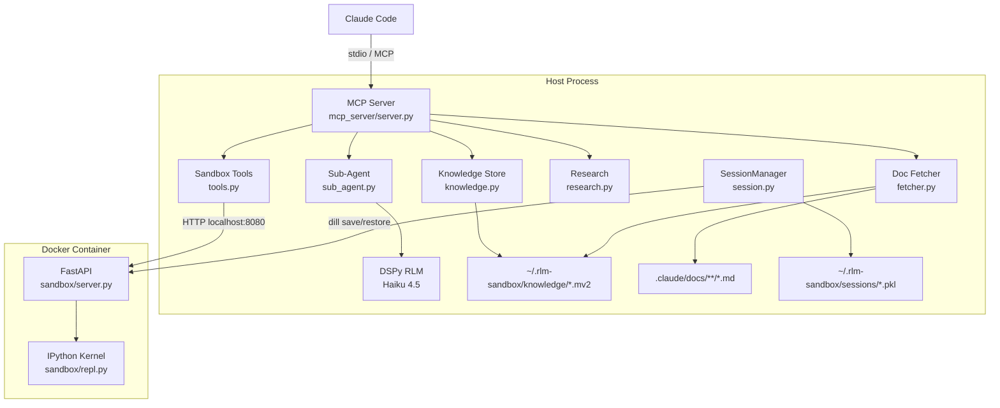
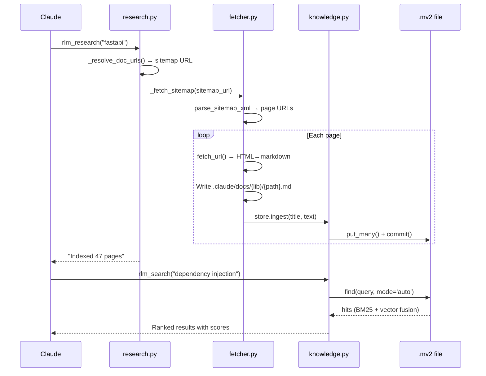
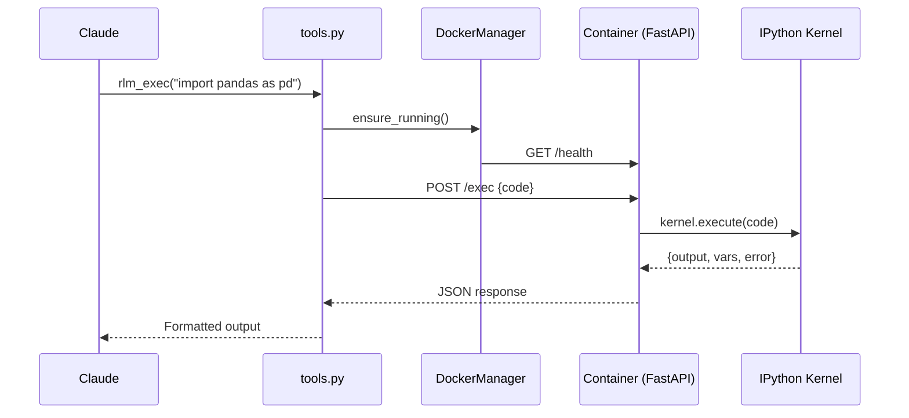

# Codebase Map

> Auto-generated by Mercator AI. Last mapped: 2026-02-13T20:07:04Z

## System Overview

Claude Code plugin: sandboxed Python execution + zero-context doc search via MCP. 16 tools across sandbox execution, knowledge store, doc fetching, and research automation. Code runs in Docker containers with no network access. Documentation gets indexed into memvid `.mv2` files for hybrid BM25+vector search.



## Directory Structure

```
rlm-sandbox/
  .claude-plugin/         Plugin manifest (plugin.json)
  .mcp.json               MCP server registration for Claude Code
  agents/                 Custom agent definitions (2 agents)
  claude-integration/     Alternative project-local install config
  docs/plans/             Spec-driven planning (manifest, specs, progress, findings)
  hooks/                  PostToolUse hook for Context7 routing
  mcp_server/             Host-side MCP server (11 modules, ~15k tokens)
  research/               Prototypes and spike results (3 prototypes + benchmarks)
  sandbox/                Container-side code (FastAPI + IPython kernel)
  scripts/                Plugin scripts (setup, start, context7 hook)
  skills/                 User-facing skills (2 skills)
  tests/                  Test suite (209 tests, 8 files)
  workspace/              Shared volume for host↔container data transfer
```

## Module Guide

### mcp_server/ (Host-Side MCP Server)

The core of the plugin. Registers 16 MCP tools and manages Docker, knowledge store, sessions, and DSPy.

| File | Purpose | Tokens |
|------|---------|--------|
| `server.py` | Entry point. FastMCP instance, lifespan context, tool registration chain | 422 |
| `tools.py` | 6 sandbox tools: exec, load, get, vars, sub_agent, reset | 1,193 |
| `knowledge.py` | KnowledgeStore class + 4 search tools: search, ask, timeline, ingest | 2,644 |
| `fetcher.py` | Doc fetching + dual storage: 3 tools (fetch, load_dir, fetch_sitemap) | 3,591 |
| `research.py` | Compound research + 3 management tools (research, status, clear) | 2,282 |
| `sub_agent.py` | DSPy RLM wrapper, SandboxInterpreter, llm_query callback | 1,445 |
| `signatures.py` | DSPy signature builder + 4 pre-built signatures | 720 |
| `session.py` | Session persistence via dill snapshots (5-min auto-save) | 1,036 |
| `docker_manager.py` | Container lifecycle: start, stop, health checks, bare fallback | 1,428 |

**Tool registration chain:**
```
server.py → register_tools(mcp)           # 6 sandbox tools
           → register_knowledge_tools(mcp)  # 4+1 knowledge tools
           → register_fetcher_tools(mcp)    # 3 fetcher tools
           → register_research_tools(mcp)   # 3 research tools
```

**Key dependencies:** `mcp[cli]`, `httpx`, `docker`, `dspy`, `memvid-sdk`, `sentence-transformers`, `html2text`

### sandbox/ (Container-Side)

Runs inside Docker. Exposes a FastAPI HTTP server around an IPython kernel.

| File | Purpose | Tokens |
|------|---------|--------|
| `server.py` | FastAPI app: /exec, /vars, /var/:name, /health, /snapshot/* | 634 |
| `repl.py` | IPython kernel wrapper: execute, get_vars, get_var, reset | 687 |

**Isolation:** No network (DNS=0.0.0.0), no API keys, 2GB RAM cap, 2 CPUs. Container packages: fastapi, uvicorn, ipython, dill.

### scripts/

| File | Purpose | Tokens |
|------|---------|--------|
| `start-server.sh` | MCP entry point (auto-setup on first run, exec python) | 117 |
| `setup.sh` | Creates venv, installs deps, builds Docker image | 500 |
| `context7-to-mv2.sh` | PostToolUse hook: suggests indexing Context7 results | 351 |

### agents/

| File | Purpose | Tokens |
|------|---------|--------|
| `rlm-researcher.md` | Sonnet agent for doc research (fetch + index workflow) | 845 |
| `rlm-sandbox.md` | Sonnet agent for sandboxed code execution | 790 |

### skills/

| File | Purpose | Tokens |
|------|---------|--------|
| `knowledge-status/SKILL.md` | Check what's indexed, interpret results, suggest population | 2,308 |
| `research/SKILL.md` | Research a topic: fetch docs, index, verify searchability | 2,410 |

### tests/ (209 tests)

| File | Covers | Type | Tokens |
|------|--------|------|--------|
| `test_fetcher.py` | fetcher.py | Unit (mocked HTTP) | 4,740 |
| `test_knowledge.py` | knowledge.py | Unit (mocked memvid) | 5,936 |
| `test_research.py` | research.py | Unit (mocked HTTP/store) | 4,711 |
| `test_sub_agent.py` | sub_agent.py + signatures.py | Unit (mocked DSPy) | 3,509 |
| `test_sandbox.py` | sandbox/* | Integration (live Docker) | 1,238 |
| `test_persistence.py` | session.py + snapshot routes | Integration (live Docker) | 1,538 |
| `test_integration.py` | End-to-end MCP → Docker | Integration (live Docker) | 1,101 |

### docs/plans/ (Spec-Driven Planning)

| File | Purpose | Tokens |
|------|---------|--------|
| `manifest.md` | Dependency DAG, phase/sprint/spec mapping | 791 |
| `progress.md` | Session-by-session implementation log with commits | 3,284 |
| `findings.md` | Technical decisions (sandbox tiers, DSPy host-side, FAISS→memvid reversal) | 3,507 |
| `specs/*.md` | 10 component specs (docker-sandbox, dspy, mcp-server, fetcher, search, etc.) | ~10k |

### research/ (Prototypes and Spikes)

| Directory | What | Outcome |
|-----------|------|---------|
| `srt-prototype/` | Bare-process sandbox with srt isolation | 15/15 tests, ~200ms startup |
| `hybrid-prototype/` | Docker container + srt for MCP server | 7/7 tests, ~4s startup |
| `knowledge-spike/` | FAISS vs memvid benchmarks + smoke tests | memvid-sdk chosen (ARM64, hybrid search) |
| `knowledge-spike/corpus/` | 15 cheat sheets used as benchmark corpus | ~52KB test data |

## Data Flow

### Knowledge Pipeline (fetch → search)



### Sandbox Execution



## Conventions

- **MCP tools** use `@mcp.tool()` decorator, registered via `register_*_tools(mcp)` functions
- **Async throughout**: All MCP tools are async, use httpx.AsyncClient for container HTTP
- **Singleton stores**: One KnowledgeStore per project hash, cached in module-level dict
- **Graceful degradation**: Docker optional (knowledge tools work without it), embedder optional (BM25 fallback)
- **Content-addressed paths**: Project hash from `sha256(cwd)[:16]`, URL→filepath for doc cache
- **Security deny-lists**: DENY_PATHS in tools.py blocks credential directories, BLOCKED_DOMAINS in fetcher.py
- **Testing**: Unit tests mock all externals (httpx, memvid, dspy). Integration tests need live Docker.

## Gotchas

- **DNS blocking, not network=none**: Container uses `--dns 0.0.0.0` on bridge network (not `--network=none`) because `none` breaks port mapping from host
- **DSPy runs host-side**: API keys never enter the container. sub_agent.py manages the LM client on the host and routes code to the container for execution
- **Embedder fallback is silent**: If sentence-transformers fails to load, search degrades to BM25-only without user-visible warning (only in server logs)
- **Session ID is path-dependent**: Moving the project directory creates a new session ID (old snapshots become orphaned)
- **Dual storage means double writes**: Every fetch writes both a raw `.md` file and ingests into `.mv2`. Clearing the store doesn't clear the raw files (by design — they serve as TLDR cache)
- **memvid chose over FAISS**: Architecture was reversed mid-development (2026-02-13). Research spike initially picked FAISS, then switched to memvid-sdk after discovering the Python SDK's ARM64 support and hybrid search
- **Auto-save can fail silently**: SessionManager's 5-minute auto-save catches and logs exceptions but doesn't retry or alert

## Navigation Guide

**To add a new MCP tool**: Create the function in the appropriate module (tools.py for sandbox, knowledge.py for search, fetcher.py for fetch, research.py for orchestration), decorate with `@mcp.tool()`, add tests

**To modify Docker isolation**: Edit `docker-compose.yml` (resource limits), `Dockerfile` (packages), `docker_manager.py` (startup flags)

**To add a new known library for rlm_research**: Add entry to `KNOWN_DOCS` dict in `research.py`

**To change search behavior**: Edit `KnowledgeStore.search()` in `knowledge.py` (adaptive retrieval params, default mode)

**To add a new agent**: Create `agents/{name}.md` with frontmatter (name, description, tools, model, mcpServers)

**To add a new skill**: Create `skills/{name}/SKILL.md` with frontmatter, 1,500+ words progressive disclosure

**To run tests**: `pytest tests/ -v` (unit tests work anywhere, integration tests need `docker compose up`)
