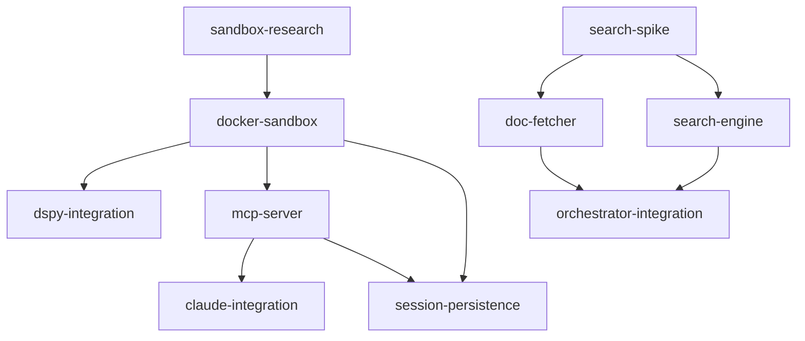

# Findings & Decisions

## Goal
Build an MCP-bridged Docker sandbox that gives Claude Code a persistent variable space (RLM pattern), keeping data out of the context window.

## Priority
Quality

## Mode
spec-driven

## Approach
Docker container with FastAPI + IPython kernel, exposed to Claude Code via an MCP server.
DSPy RLM runs inside the container for sub-agent work. Session state persists via dill snapshots.
Learned from rlmgrep: use dspy.RLM's Signature + Interpreter pattern, but replace ephemeral Deno
with a persistent IPython kernel and add MCP bridging.

**Update 2026-02-12:** Before committing to Docker-only, research spike (Phase 0) will evaluate
three sandbox paths using Anthropic's official sandbox infrastructure. Docker-sandbox spec
will implement whichever path wins.

## Requirements
- Docker sandbox with FastAPI (persistent IPython kernel, /exec /vars endpoints)
- MCP server on host (stdio transport, lazy container startup, 6 tools)
- DSPy RLM integration (sub_agent via sub_lm, Haiku 4.5 default) — stays in-container regardless of sandbox path
- Claude Code integration (mcp-config.json, CLAUDE.md routing rules)
- **NEW:** Evaluate Anthropic sandbox infrastructure integration (srt, Docker Sandboxes)

## Spec Map
-> Manifest: docs/plans/manifest.md
-> Specs directory: docs/plans/specs/

### Dependency DAG

### Per-Spec Decisions
| Spec | Key Decision | Rationale | Affects |
|------|-------------|-----------|---------|
| sandbox-research | Evaluate 3 paths before building | Anthropic's sandbox infra could simplify or strengthen our architecture | docker-sandbox, mcp-server, claude-integration |
| sandbox-research | DSPy stays in-container | Simpler architecture, matches rlmgrep pattern, user preference | dspy-integration (unchanged) |
| docker-sandbox | IPython kernel over Deno | Persistent state, Python-native, dill-compatible | dspy-integration, session-persistence |
| docker-sandbox | --network=none | Security: sandbox code shouldn't exfiltrate | all downstream |
| dspy-integration | Haiku 4.5 for sub_lm | Cost-effective for code-gen sub-tasks | mcp-server (tool config) |
| dspy-integration | SandboxInterpreter subclass | Reuse DSPy's interface but route to our kernel | docker-sandbox |
| mcp-server | stdio transport | Claude Code's native discovery method | claude-integration |
| mcp-server | Lazy startup | Zero overhead when RLM not needed | all downstream |
| session-persistence | dill over pickle | Handles lambdas, closures, computed objects | docker-sandbox |
| search-spike | Research before building | memvid-sdk vs FAISS+ONNX, host vs container — need data | search-engine |
| doc-fetcher | Host-side fetching | Container has no network; fetcher must run in MCP server | search-engine, orchestrator-integration |
| doc-fetcher | .md URL first | Cleaner content, no HTML→markdown conversion needed | search-engine (better chunks) |
| search-engine | ONNX over PyTorch | ~120MB vs ~2GB model dependency; ONNX runs on CPU efficiently | all downstream |
| orchestrator-integration | Additive to Stage 4 | Keep existing cheat-sheet flow as fallback; add knowledge store on top | orchestrator skill files |

## Sprint Grouping
| Sprint | Specs | Can Parallelize |
|--------|-------|-----------------|
| Phase 0, Sprint 1 | sandbox-research | no (single spec, gates everything) |
| Phase 1, Sprint 1 | docker-sandbox | no (single spec) |
| Phase 1, Sprint 2 | dspy-integration, mcp-server | yes |
| Phase 2, Sprint 1 | session-persistence, claude-integration | yes |
| Phase 3, Sprint 1 | search-spike | no (research, single spec) |
| Phase 4, Sprint 1 | doc-fetcher, search-engine | yes |
| Phase 4, Sprint 2 | orchestrator-integration | no (single spec) |

## Research Findings

### rlmgrep Reference (2026-02-11)
- rlmgrep (github.com/halfprice06/rlmgrep) uses dspy.RLM with a Deno-based PythonInterpreter
- Core API: `dspy.RLM(signature, sub_lm=sub_lm, interpreter=interpreter)`
- rlmgrep's interpreter subclasses dspy.PythonInterpreter and overrides _ensure_deno_process
- File data is passed as a `directory: dict` input field — entire codebase in one dict
- DSPy dependencies: dspy>=3.1.1 (for RLM support)
- rlmgrep uses custom signature builder for arbitrary output fields — portable to our sandbox
- The interpreter pattern is the key abstraction: swap the execution backend, keep the RLM logic

### Anthropic Sandbox Infrastructure (2026-02-12)
Three layers exist in Anthropic's sandbox ecosystem:

**1. Native sandbox (/sandbox command)**
- OS-level enforcement: macOS seatbelt, Linux bubblewrap
- Two modes: auto-allow (sandboxed commands run without prompting) and regular permissions
- Filesystem: write restricted to cwd, read restricted via deny list
- Network: proxy-based domain filtering, all traffic goes through host-side proxy
- Config: settings.json with sandbox.network and sandbox.filesystem sections
- Escape hatch: `dangerouslyDisableSandbox` parameter (disableable via allowUnsandboxedCommands: false)
- MCP tools are NOT sandboxed by bash sandbox — they go through MCP permission flow
- Docs: https://code.claude.com/docs/en/sandboxing

**2. sandbox-runtime (srt) — @anthropic-ai/sandbox-runtime**
- Open-source npm package, research preview
- Wraps any process with filesystem + network restrictions at OS level
- No container overhead — uses seatbelt (macOS) or bubblewrap (Linux) directly
- TypeScript API: `SandboxManager.initialize(config)` + `SandboxManager.wrapWithSandbox(cmd)`
- Config: allowedDomains, denyRead, allowWrite, denyWrite, allowUnixSockets
- Can sandbox MCP servers: `srt <mcp-server-command>`
- Limitation: no cgroups-based resource limits (CPU/memory)
- Limitation: Linux allowWrite requires literal paths (no globs)
- Repo: https://github.com/anthropic-experimental/sandbox-runtime

**3. Docker Sandboxes (Docker Desktop product)**
- Runs entire Claude Code agent in an isolated microVM
- Each sandbox gets its own Docker daemon (supports nested containers)
- Base image: Ubuntu + Node.js + Go + Python 3 + Docker CLI + GitHub CLI
- Agent runs with --dangerously-skip-permissions (VM is the boundary)
- Setup: `docker sandbox run claude ~/project`
- Can build/run Docker containers inside the sandbox
- Docs: https://docs.docker.com/ai/sandboxes/claude-code/

### Key Insight: These Layers Are Complementary
- Native /sandbox restricts Claude Code's bash commands — security for the agent
- srt restricts arbitrary processes — security for our MCP server
- Docker Sandboxes isolate the whole agent — deployment/hosting concern
- neo-research creates a tool for the agent — different axis entirely
- They compose: neo-research MCP server could be srt-wrapped while Claude runs with /sandbox enabled

### Three Candidate Paths for sandbox-research spec
| Path | Approach | Pros | Cons |
|------|----------|------|------|
| A: srt-only | IPython kernel as bare process, wrapped with srt | No Docker dep, fast startup, lighter | No resource limits, weaker isolation |
| B: Hybrid | Docker for kernel + srt for MCP server | Defense-in-depth, best isolation | More moving parts |
| C: Docker Sandboxes | Whole stack in Docker Sandbox VM | Maximum isolation | Docker Desktop required, heavier, Docker-in-Docker |

### Research Spike Results (2026-02-12, prototypes built and tested)

**Recommendation: Hybrid (Path B) for production, srt-only (Path A) as --no-docker fallback.**

Measured results:
- srt-only startup: ~200ms, 15/15 tests pass
- Hybrid startup: ~4s (cold build), 7/7 tests pass
- Docker Sandboxes: `docker sandbox` unavailable in Docker Desktop 28.0.1

Critical findings:
- srt `allowLocalBinding: true` lets host connect to sandboxed process on localhost
- `--network=none` breaks port mapping → use `--dns 0.0.0.0` on bridge instead
- srt wrapping MCP server + Docker for kernel = strongest practical isolation
- srt and Claude Code's native `/sandbox` don't conflict (sandbox different processes)

Implementation impact on specs:
- docker-sandbox: change `--network=none` to `--dns 0.0.0.0` (or Unix socket future)
- mcp-server: add srt wrapping, add `--no-docker` flag for srt-only fallback
- claude-integration: document /sandbox compatibility, tiered isolation modes

Full comparison: research/comparison.md

### DSPy Decision
**Updated 2026-02-12:** DSPy moves **host-side** to the MCP server. Avoids putting
ANTHROPIC_API_KEY in the container. The SandboxInterpreter implements the CodeInterpreter
protocol and routes code execution to the container's /exec endpoint via HTTP. LLM calls
(llm_query) use a callback stub in the container that POSTs to the host. The kernel's
hosting method (Docker, srt, bare process) remains transparent to DSPy.

## Technical Decisions
| Decision | Rationale |
|----------|-----------|
| Docker over Deno | Persistent kernel state, full Python ecosystem, resource limits, volume mounts |
| FastAPI inside container | Simple HTTP API, async-native, good for /exec streaming |
| MCP over custom Claude tools | Native discovery, no Claude Code modifications needed |
| dill for persistence | Broader type coverage than pickle — matters for computed analysis objects |
| Haiku 4.5 for sub-agents | Cheapest model that handles code generation well enough for sandbox tasks |
| Research spike before implementation | Anthropic's sandbox infra could simplify or strengthen the architecture |
| DSPy runs host-side in MCP server | API key stays on host, stronger isolation, no secrets in container |
| MCP Python SDK (MCPServer class) | Decorator-based tool registration, automatic schema generation, lifespan hooks |
| Separate .claude/ routing rules | Don't modify user's CLAUDE.md — use include file in .claude/ |
| Session ID = hash of working dir | Per-project isolation by default, no user configuration needed |
| Dedicated /snapshot endpoints | Cleaner than POST /exec with dill code; explicit save/restore API |
| Hybrid (Docker+srt) as primary | Docker gives cgroups, srt gives MCP server isolation — tested, 7/7 pass |
| srt-only as --no-docker fallback | 200ms startup, no Docker dep — tested, 15/15 pass |
| --dns 0.0.0.0 over --network=none | Port mapping needs bridge network; --dns blocks DNS resolution |
| Three-tier isolation model | Tier 1 (srt), Tier 2 (Docker+srt), Tier 3 (Docker Sandboxes) — users pick |
| ~~FAISS+fastembed over memvid-sdk~~ **REVERSED** | See addendum below — memvid v2 SDK has working vec, hybrid search, and local embeddings |
| Search engine runs host-side | Heavy compute stays on host; container stays lean; matches DSPy pattern |
| **memvid-sdk as knowledge store** | Single .mv2 file replaces FAISS index + metadata sidecar. Built-in BM25 + vec + hybrid + adaptive retrieval |
| **Dual storage (raw + .mv2)** | Raw .md files for TLDR cache (93% token savings), .mv2 for semantic search without context consumption |
| **Local embeddings via fastembed-python** | BGE-small-en-v1.5 (384d, ~50MB model), pip install only. Ollama (1024d) as upgrade path. No API keys, no services |

### Knowledge Store Search Decision (2026-02-12, Phase 3 Spike)

**~~We chose FAISS + fastembed~~ REVERSED 2026-02-13: We are committing to memvid-sdk.**

Original spike (2026-02-12) tested memvid-sdk v2.0.156 and found issues: BM25 parser choked on stop words, vec feature compiled out of macOS ARM64 wheel, broken Python SDK imports. FAISS+fastembed worked at that time.

**Reversal rationale (2026-02-13):**
- Full memvid v2 docs now fetched and stored locally (89 pages at .claude/docs/memvid/)
- Current docs show: built-in fastembed BGE-small works on macOS (Python/ONNX, not compiled Rust), Ollama embeddings as upgrade path, hybrid search (BM25 + vec + reranker), adaptive retrieval, timeline queries
- memvid provides: single .mv2 file (no index + sidecar), crash-safe WAL, incremental indexing, entity extraction, session replay, deduplication — far more than FAISS alone
- The spike likely tested a broken wheel; the underlying architecture supports macOS ARM64 via fastembed (ONNX Runtime)
- User decision: commit to memvid, use its full feature set (lex, vec, time, entity extraction)

**Smoke test results (2026-02-13):**
- fastembed compiled out of ARM64 wheel (confirmed) — `put(enable_embedding=True)` fails with EmbeddingFailedError
- Ollama + mxbai-embed-large (1024d) works perfectly via `put_many(docs, embedder=OllamaEmbeddings(...))`
- Semantic search: "how do I build a REST API?" → FastAPI ranked #1 (0.59 score), 5/5 hits
- Hybrid search: "Python testing framework" → pytest ranked #1 (0.60 score)
- BM25 (lex): keyword queries work, NL queries return 0 (expected — BM25 is keyword-based)
- `ask()` has TimeIndexMissingError on newly created files (SDK bug, workaround: skip ask for now, use find)
- API pattern: `put_many()` accepts custom `embedder=` param; `put()` only uses built-in fastembed (broken on ARM64)
- **Follow-up discovery:** fastembed-python (`pip install fastembed`) works as a custom embedder via `put_many(docs, embedder=FastembedEmbeddings())`
- fastembed-python uses ONNX Runtime (has ARM64 support), same BGE-small model, 384d, 2-4ms search, 0.6s ingest for 5 docs
- This is different from memvid's Rust-compiled fastembed — Python package works, Rust feature doesn't
- Conclusion: **fastembed-python is the default embedding path**. No Ollama needed. Ollama is upgrade path for 1024d quality.

Hosting model: **host-side** (unchanged). Container has no network for model download.

Full benchmark data: `research/knowledge-spike/benchmark_results.md`

## Monolith Comparison (2026-02-17)

Compared with WingchunSiu/Monolith (TreeHacks 2026 winner). Same RLM paper lineage, different architectural bets.

### Monolith strengths we lack
1. **Auto-capture session transcripts** — Stop hook uploads every session to Modal Volume. We have no equivalent auto-capture.
2. **Explicit 3-phase reasoning strategy** in prompts.py (Recon → Filter → Aggregate). Our DSPy RLM uses generic loop.
3. **Thread-based context accumulation** — thread_id concept groups context by topic. Our knowledge store is project-scoped only.
4. **Cost-efficient model tiering** — GPT-5 orchestrates, GPT-5-nano does bulk. Prompt limits calls to 5-10.

### Our strengths over Monolith
1. Vector+BM25 hybrid search vs flat-text regex scanning
2. Docker sandbox with null DNS, no API keys in container
3. 20 MCP tools vs 2
4. Local-first, no cloud dependency
5. Session persistence preserves computation state (dill), not just text

### Decision: Close 5 gaps
- Session auto-capture via CLI bridge script (not MCP dependency)
- Deep reasoning DSPy signature with 3-phase instructions
- Thread/namespace filtering on knowledge store (metadata convention)
- Parallel llm_query_batch via ThreadPoolExecutor in sandbox stub
- Token tracking: accumulator in callback server + rlm_usage tool

### Programmatic Tool Calling (2026-02-17)
Analyzed Anthropic's `code_execution_20250825` + `allowed_callers` pattern. Our neo-research is already the "self-managed sandboxed execution" variant they describe. Gap: we only expose `llm_query()` in the sandbox. Their pattern exposes any tool marked with `allowed_callers`. Generalizing our callback server from single-function to multi-tool dispatch lets sandbox code call knowledge search, doc fetch, etc. — processing results programmatically without intermediate data entering Claude Code's context window.

Key token savings: 10 tool calls programmatically costs ~1/10th the tokens vs direct tool calls, because intermediate results stay in the sandbox.

### Design choices made
| Choice | Decision | Rationale |
|--------|----------|-----------|
| Capture path | CLI bridge (standalone) | Works without MCP server running |
| Parallelism | ThreadPoolExecutor in sandbox | No new deps, callback server already async |
| Cost output | Sub-agent result + rlm_usage tool | Both per-run and cumulative visibility |
| Multi-tool dispatch | Generalize callback server + auto-inject stubs | Matches Anthropic's pattern, additive to existing llm_query |

## Visual/Browser Findings
- rlmgrep repo structure: 7 core Python files, ~800 lines total
- Key pattern: Signature defines I/O, Interpreter executes code, RLM orchestrates
- Anthropic sandboxing docs at code.claude.com/docs/en/sandboxing (redirected from docs.anthropic.com)
- sandbox-runtime repo has TypeScript SandboxManager API with initialize/wrapWithSandbox/reset

## Knowledge Store Findings

### Chunk Normalization Problem (2026-02-18, migration audit)

During batch migration of old `~/.claude/docs/` research into the new `~/.claude/research/` pipeline, search quality varied with document size disparity.

**Observed:** When ingesting mixed-size documents into a single project store, large documents dominate search results. In the `aviation-geospatial` project, FlightAware's 47K-char doc was the only result returned for every query — the 3-5K docs (OpenSky, GeoNames, Cesium) never surfaced despite containing relevant content.

**Contrast:** The `sam3d-baseball` project had evenly-sized docs (5-10K each) and search worked well across all 8 documents — every query returned the expected doc as top hit.

**Root cause hypothesis:** Single-frame ingestion for small docs means the entire doc is one chunk. When a large doc also gets one frame, the embedding averages over more content and becomes a "generalist" vector that matches many queries at moderate scores, crowding out smaller docs whose single embedding may be more specific but lower-scoring.

**Proposed fix: Chunk normalization during ingestion.**
- Split documents into ~2-4K char chunks before embedding
- Each chunk becomes its own frame with title + chunk index metadata
- This equalizes representation across documents of different sizes
- Already standard practice in RAG systems (LangChain, LlamaIndex all do this)

**Impact:** Affects any project that mixes API reference pages (often 20-50K) with overview docs (2-5K). Most real research topics have this distribution.

**Priority:** Medium-high — directly affects search quality, which is the core value prop of the knowledge store.
