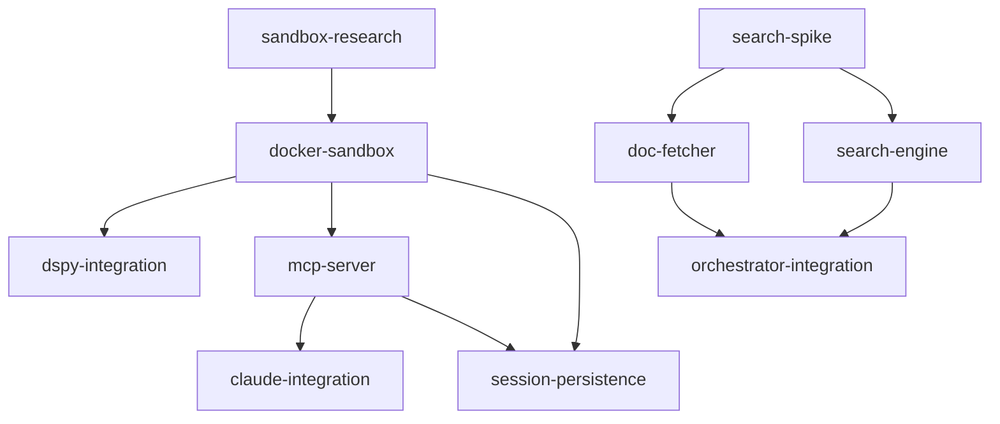

# Findings & Decisions

## Goal
Build an MCP-bridged Docker sandbox that gives Claude Code a persistent variable space (RLM pattern), keeping data out of the context window.

## Priority
Quality

## Mode
spec-driven

## Approach
Docker container with FastAPI + IPython kernel, exposed to Claude Code via an MCP server.
DSPy RLM runs inside the container for sub-agent work. Session state persists via dill snapshots.
Learned from rlmgrep: use dspy.RLM's Signature + Interpreter pattern, but replace ephemeral Deno
with a persistent IPython kernel and add MCP bridging.

**Update 2026-02-12:** Before committing to Docker-only, research spike (Phase 0) will evaluate
three sandbox paths using Anthropic's official sandbox infrastructure. Docker-sandbox spec
will implement whichever path wins.

## Requirements
- Docker sandbox with FastAPI (persistent IPython kernel, /exec /vars endpoints)
- MCP server on host (stdio transport, lazy container startup, 6 tools)
- DSPy RLM integration (sub_agent via sub_lm, Haiku 4.5 default) — stays in-container regardless of sandbox path
- Claude Code integration (mcp-config.json, CLAUDE.md routing rules)
- **NEW:** Evaluate Anthropic sandbox infrastructure integration (srt, Docker Sandboxes)

## Spec Map
-> Manifest: docs/plans/manifest.md
-> Specs directory: docs/plans/specs/

### Dependency DAG

### Per-Spec Decisions
| Spec | Key Decision | Rationale | Affects |
|------|-------------|-----------|---------|
| sandbox-research | Evaluate 3 paths before building | Anthropic's sandbox infra could simplify or strengthen our architecture | docker-sandbox, mcp-server, claude-integration |
| sandbox-research | DSPy stays in-container | Simpler architecture, matches rlmgrep pattern, user preference | dspy-integration (unchanged) |
| docker-sandbox | IPython kernel over Deno | Persistent state, Python-native, dill-compatible | dspy-integration, session-persistence |
| docker-sandbox | --network=none | Security: sandbox code shouldn't exfiltrate | all downstream |
| dspy-integration | Haiku 4.5 for sub_lm | Cost-effective for code-gen sub-tasks | mcp-server (tool config) |
| dspy-integration | SandboxInterpreter subclass | Reuse DSPy's interface but route to our kernel | docker-sandbox |
| mcp-server | stdio transport | Claude Code's native discovery method | claude-integration |
| mcp-server | Lazy startup | Zero overhead when RLM not needed | all downstream |
| session-persistence | dill over pickle | Handles lambdas, closures, computed objects | docker-sandbox |
| search-spike | Research before building | memvid-sdk vs FAISS+ONNX, host vs container — need data | search-engine |
| doc-fetcher | Host-side fetching | Container has no network; fetcher must run in MCP server | search-engine, orchestrator-integration |
| doc-fetcher | .md URL first | Cleaner content, no HTML→markdown conversion needed | search-engine (better chunks) |
| search-engine | ONNX over PyTorch | ~120MB vs ~2GB model dependency; ONNX runs on CPU efficiently | all downstream |
| orchestrator-integration | Additive to Stage 4 | Keep existing cheat-sheet flow as fallback; add knowledge store on top | orchestrator skill files |

## Sprint Grouping
| Sprint | Specs | Can Parallelize |
|--------|-------|-----------------|
| Phase 0, Sprint 1 | sandbox-research | no (single spec, gates everything) |
| Phase 1, Sprint 1 | docker-sandbox | no (single spec) |
| Phase 1, Sprint 2 | dspy-integration, mcp-server | yes |
| Phase 2, Sprint 1 | session-persistence, claude-integration | yes |
| Phase 3, Sprint 1 | search-spike | no (research, single spec) |
| Phase 4, Sprint 1 | doc-fetcher, search-engine | yes |
| Phase 4, Sprint 2 | orchestrator-integration | no (single spec) |

## Research Findings

### rlmgrep Reference (2026-02-11)
- rlmgrep (github.com/halfprice06/rlmgrep) uses dspy.RLM with a Deno-based PythonInterpreter
- Core API: `dspy.RLM(signature, sub_lm=sub_lm, interpreter=interpreter)`
- rlmgrep's interpreter subclasses dspy.PythonInterpreter and overrides _ensure_deno_process
- File data is passed as a `directory: dict` input field — entire codebase in one dict
- DSPy dependencies: dspy>=3.1.1 (for RLM support)
- rlmgrep uses custom signature builder for arbitrary output fields — portable to our sandbox
- The interpreter pattern is the key abstraction: swap the execution backend, keep the RLM logic

### Anthropic Sandbox Infrastructure (2026-02-12)
Three layers exist in Anthropic's sandbox ecosystem:

**1. Native sandbox (/sandbox command)**
- OS-level enforcement: macOS seatbelt, Linux bubblewrap
- Two modes: auto-allow (sandboxed commands run without prompting) and regular permissions
- Filesystem: write restricted to cwd, read restricted via deny list
- Network: proxy-based domain filtering, all traffic goes through host-side proxy
- Config: settings.json with sandbox.network and sandbox.filesystem sections
- Escape hatch: `dangerouslyDisableSandbox` parameter (disableable via allowUnsandboxedCommands: false)
- MCP tools are NOT sandboxed by bash sandbox — they go through MCP permission flow
- Docs: https://code.claude.com/docs/en/sandboxing

**2. sandbox-runtime (srt) — @anthropic-ai/sandbox-runtime**
- Open-source npm package, research preview
- Wraps any process with filesystem + network restrictions at OS level
- No container overhead — uses seatbelt (macOS) or bubblewrap (Linux) directly
- TypeScript API: `SandboxManager.initialize(config)` + `SandboxManager.wrapWithSandbox(cmd)`
- Config: allowedDomains, denyRead, allowWrite, denyWrite, allowUnixSockets
- Can sandbox MCP servers: `srt <mcp-server-command>`
- Limitation: no cgroups-based resource limits (CPU/memory)
- Limitation: Linux allowWrite requires literal paths (no globs)
- Repo: https://github.com/anthropic-experimental/sandbox-runtime

**3. Docker Sandboxes (Docker Desktop product)**
- Runs entire Claude Code agent in an isolated microVM
- Each sandbox gets its own Docker daemon (supports nested containers)
- Base image: Ubuntu + Node.js + Go + Python 3 + Docker CLI + GitHub CLI
- Agent runs with --dangerously-skip-permissions (VM is the boundary)
- Setup: `docker sandbox run claude ~/project`
- Can build/run Docker containers inside the sandbox
- Docs: https://docs.docker.com/ai/sandboxes/claude-code/

### Key Insight: These Layers Are Complementary
- Native /sandbox restricts Claude Code's bash commands — security for the agent
- srt restricts arbitrary processes — security for our MCP server
- Docker Sandboxes isolate the whole agent — deployment/hosting concern
- rlm-sandbox creates a tool for the agent — different axis entirely
- They compose: rlm-sandbox MCP server could be srt-wrapped while Claude runs with /sandbox enabled

### Three Candidate Paths for sandbox-research spec
| Path | Approach | Pros | Cons |
|------|----------|------|------|
| A: srt-only | IPython kernel as bare process, wrapped with srt | No Docker dep, fast startup, lighter | No resource limits, weaker isolation |
| B: Hybrid | Docker for kernel + srt for MCP server | Defense-in-depth, best isolation | More moving parts |
| C: Docker Sandboxes | Whole stack in Docker Sandbox VM | Maximum isolation | Docker Desktop required, heavier, Docker-in-Docker |

### Research Spike Results (2026-02-12, prototypes built and tested)

**Recommendation: Hybrid (Path B) for production, srt-only (Path A) as --no-docker fallback.**

Measured results:
- srt-only startup: ~200ms, 15/15 tests pass
- Hybrid startup: ~4s (cold build), 7/7 tests pass
- Docker Sandboxes: `docker sandbox` unavailable in Docker Desktop 28.0.1

Critical findings:
- srt `allowLocalBinding: true` lets host connect to sandboxed process on localhost
- `--network=none` breaks port mapping → use `--dns 0.0.0.0` on bridge instead
- srt wrapping MCP server + Docker for kernel = strongest practical isolation
- srt and Claude Code's native `/sandbox` don't conflict (sandbox different processes)

Implementation impact on specs:
- docker-sandbox: change `--network=none` to `--dns 0.0.0.0` (or Unix socket future)
- mcp-server: add srt wrapping, add `--no-docker` flag for srt-only fallback
- claude-integration: document /sandbox compatibility, tiered isolation modes

Full comparison: research/comparison.md

### DSPy Decision
**Updated 2026-02-12:** DSPy moves **host-side** to the MCP server. Avoids putting
ANTHROPIC_API_KEY in the container. The SandboxInterpreter implements the CodeInterpreter
protocol and routes code execution to the container's /exec endpoint via HTTP. LLM calls
(llm_query) use a callback stub in the container that POSTs to the host. The kernel's
hosting method (Docker, srt, bare process) remains transparent to DSPy.

## Technical Decisions
| Decision | Rationale |
|----------|-----------|
| Docker over Deno | Persistent kernel state, full Python ecosystem, resource limits, volume mounts |
| FastAPI inside container | Simple HTTP API, async-native, good for /exec streaming |
| MCP over custom Claude tools | Native discovery, no Claude Code modifications needed |
| dill for persistence | Broader type coverage than pickle — matters for computed analysis objects |
| Haiku 4.5 for sub-agents | Cheapest model that handles code generation well enough for sandbox tasks |
| Research spike before implementation | Anthropic's sandbox infra could simplify or strengthen the architecture |
| DSPy runs host-side in MCP server | API key stays on host, stronger isolation, no secrets in container |
| MCP Python SDK (MCPServer class) | Decorator-based tool registration, automatic schema generation, lifespan hooks |
| Separate .claude/ routing rules | Don't modify user's CLAUDE.md — use include file in .claude/ |
| Session ID = hash of working dir | Per-project isolation by default, no user configuration needed |
| Dedicated /snapshot endpoints | Cleaner than POST /exec with dill code; explicit save/restore API |
| Hybrid (Docker+srt) as primary | Docker gives cgroups, srt gives MCP server isolation — tested, 7/7 pass |
| srt-only as --no-docker fallback | 200ms startup, no Docker dep — tested, 15/15 pass |
| --dns 0.0.0.0 over --network=none | Port mapping needs bridge network; --dns blocks DNS resolution |
| Three-tier isolation model | Tier 1 (srt), Tier 2 (Docker+srt), Tier 3 (Docker Sandboxes) — users pick |

## Visual/Browser Findings
- rlmgrep repo structure: 7 core Python files, ~800 lines total
- Key pattern: Signature defines I/O, Interpreter executes code, RLM orchestrates
- Anthropic sandboxing docs at code.claude.com/docs/en/sandboxing (redirected from docs.anthropic.com)
- sandbox-runtime repo has TypeScript SandboxManager API with initialize/wrapWithSandbox/reset
