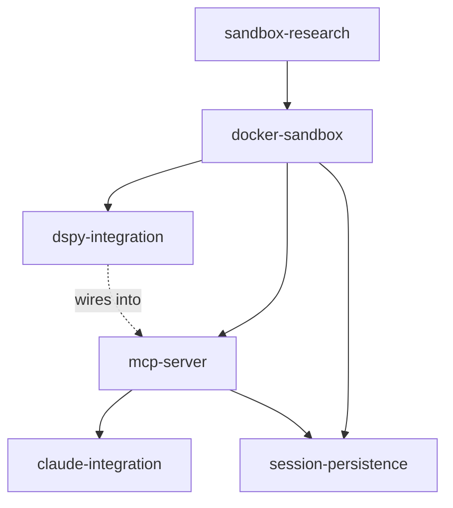

# Plan Manifest

## Dependency Graph

## Phase / Sprint / Spec Map

| Phase | Sprint | Spec | Status | Depends On |
|-------|--------|------|--------|------------|
| 0 | 1 | sandbox-research | completed | -- |
| 1 | 1 | docker-sandbox | completed | sandbox-research |
| 1 | 2 | dspy-integration | completed | docker-sandbox |
| 1 | 2 | mcp-server | completed | docker-sandbox |
| 2 | 1 | session-persistence | ready | docker-sandbox, mcp-server |
| 2 | 1 | claude-integration | ready | mcp-server |

## Spec Files

| Spec | Path | Lines | Description |
|------|------|-------|-------------|
| sandbox-research | docs/plans/specs/sandbox-research-spec.md | ~80 | Evaluate srt-only, hybrid, Docker Sandboxes paths |
| docker-sandbox | docs/plans/specs/docker-sandbox-spec.md | ~60 | Dockerfile, FastAPI server, IPython kernel |
| dspy-integration | docs/plans/specs/dspy-integration-spec.md | ~55 | DSPy RLM wrapper, sub_agent, Haiku 4.5 |
| mcp-server | docs/plans/specs/mcp-server-spec.md | ~60 | Host-side MCP, Docker lifecycle, stdio |
| session-persistence | docs/plans/specs/session-persistence-spec.md | ~45 | Save/restore sandbox state via dill |
| claude-integration | docs/plans/specs/claude-integration-spec.md | ~40 | mcp-config.json, CLAUDE.md rules |

## Findings
-> See findings.md

## Progress
-> See progress.md
